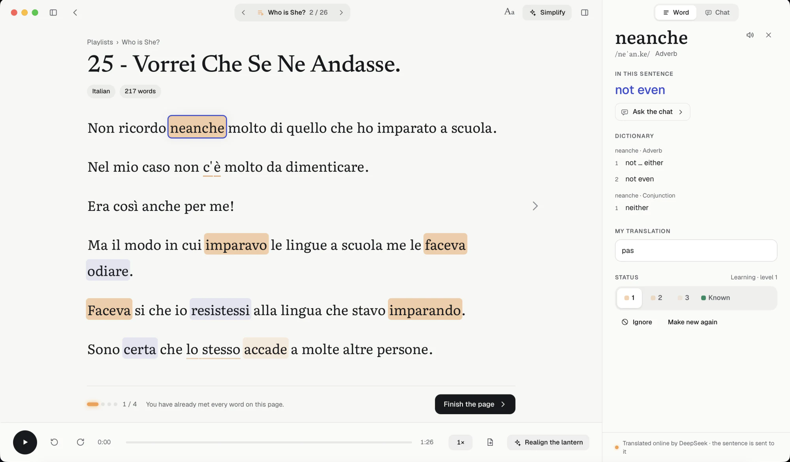
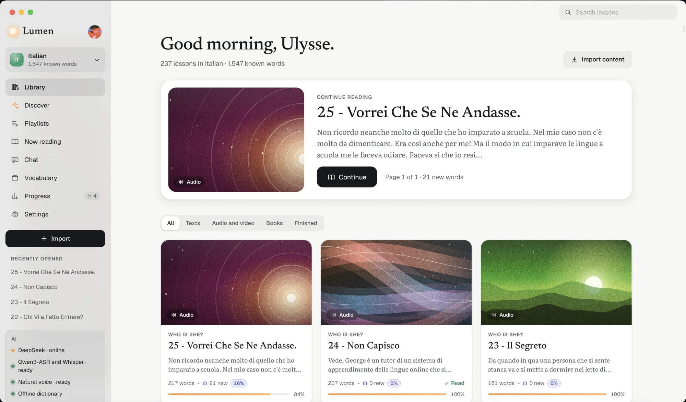
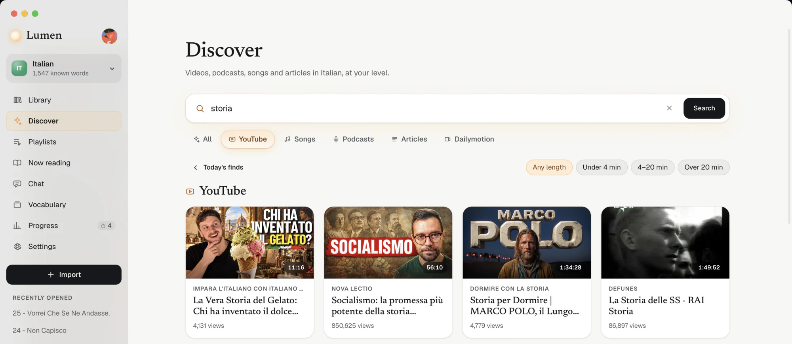
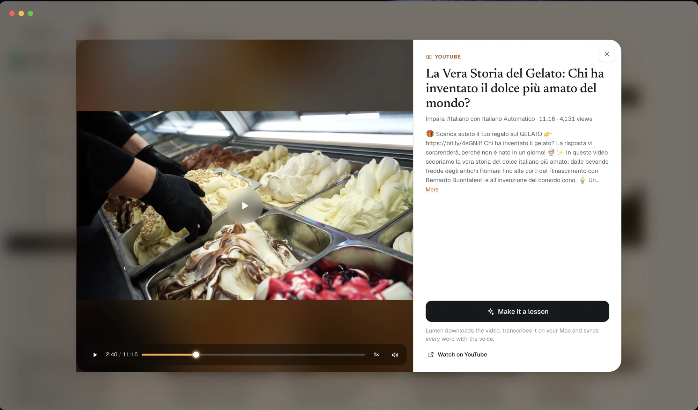
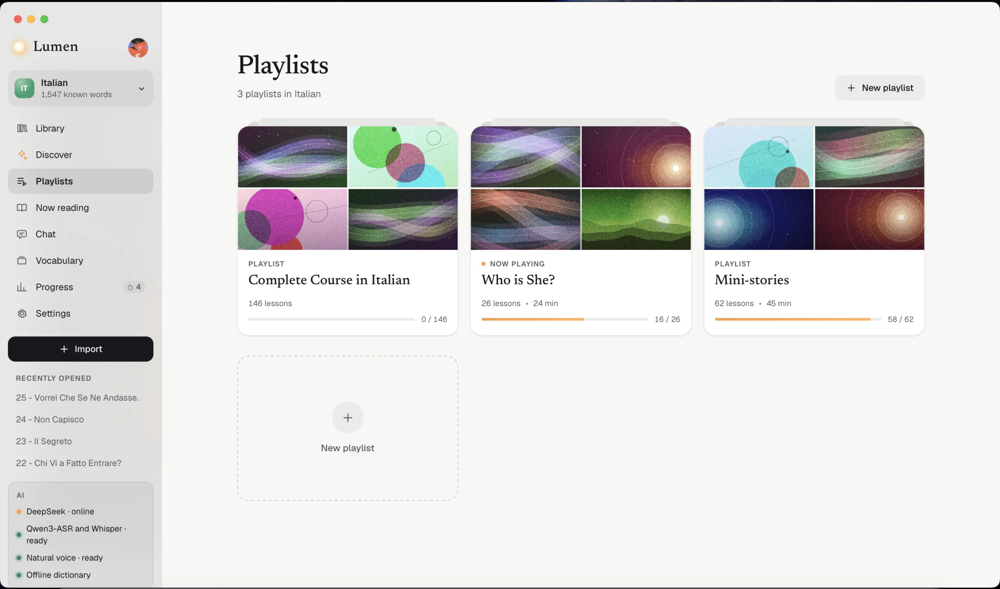
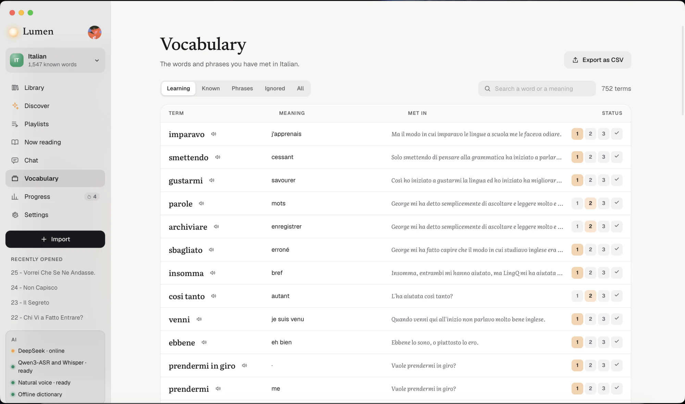
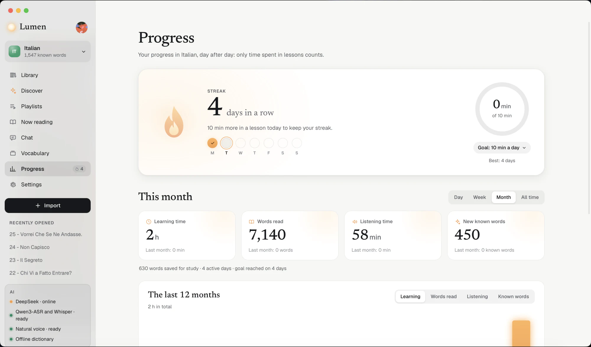

# Lumen

**Learn languages by reading and listening to what you love, with an AI that runs on your own computer.**
A desktop app for Mac (Apple silicon) and Windows 10/11, in the spirit of LingQ.

**[Download Lumen](https://github.com/LivingTwice/lumen/releases/latest)**: a DMG for Mac, an installer for Windows. Updates then install by themselves.

<p align="center">
  
</p>
<p align="center"><sub>Reading an Italian lesson. New words are tinted blue, words you're learning amber, phrases underlined. Tap a word: the dictionary and its meaning <i>in this sentence</i> appear on the right. The audio below follows the text word by word.</sub></p>

## What Lumen does

- **Read**: words are colored by what you already know (new, learning, known). Tap a word: the offline dictionary gives its base form and meanings, and the AI gives its exact meaning in that sentence. Phrases, “Finish page”, pages that fit the screen, your choice of fonts and page colors.
- **Listen**: the “lantern” follows every word of the audio or video, to the word (Whisper timings). A natural voice pronounces words and can create the audio of any text lesson. Interactive full-screen subtitles.
- **Import anything you enjoy**: text, web pages, EPUB, PDF, subtitles, audio and video files, YouTube, podcasts, Spotify, TikTok links and more, transcribed on your computer (Whisper and Qwen3-ASR). Import your words and lessons from LingQ.
- **Light on your disk**: on a Mac, imported videos and sounds are re-encoded by the Mac's own video chip while Lumen transcribes them, taking 40 to about 75% less space, with no extra wait and without shifting the sound by a single millisecond. Online videos arrive in the lightest format your computer can play.
- **Discover**: recent videos, podcasts, news and songs in 31 languages, sorted by CEFR level (A1 to C1) according to the words you know. Search YouTube, Dailymotion, podcasts, songs (with timed lyrics) and Wikipedia, and preview anything before making it a lesson.
- **Chat**: a language tutor that knows your lesson, running on your computer (Qwen3.5), with optional thinking.
- **Custom podcasts**: written and performed by Gemini at your level, with the words you're learning (optional, with your own key).
- **Progress**: study time, words read, streaks, a daily goal, a calendar.
- **Backup** to iCloud Drive, Dropbox, Google Drive, OneDrive or a disk, with no server and no account.
- **31 languages to study**, each with an offline dictionary. The interface is in English and French.

## A look around

<table>
  <tr>
    <td width="50%" valign="top">
      
      <br><b>Library</b>: your lessons by collection, with the share of new words in each and how far you've read. “Continue” takes you back to the exact word.
    </td>
    <td width="50%" valign="top">
      
      <br><b>Discover and search</b>: videos, podcasts, songs and articles in the language you're learning, at your level. Or search YouTube, songs, podcasts and articles in one place.
    </td>
  </tr>
  <tr>
    <td width="50%" valign="top">
      
      <br><b>Preview</b>: watch, listen or read before importing. One click makes it a lesson: Lumen transcribes it on your computer and syncs every word with the voice.
    </td>
    <td width="50%" valign="top">
      
      <br><b>Playlists</b>: lessons in the order you choose, played one after the other, with your place kept in each.
    </td>
  </tr>
  <tr>
    <td width="50%" valign="top">
      
      <br><b>Vocabulary</b>: every word and phrase you've met, with its meaning, the sentence you met it in and its status. Exports to Anki.
    </td>
    <td width="50%" valign="top">
      
      <br><b>Progress</b>: your streak and daily goal, study time, words read, listening time and new known words, day after day.
    </td>
  </tr>
</table>

## Your data stays with you

Translation, chat, transcription, voice and dictionaries run **on your computer**. Lumen has no account, no server and no analytics. Only what you ask for goes online:

- the content you search for or import (YouTube, podcasts, lyrics from LRCLIB, Wikipedia…);
- if you turn them on, with your own key: the **online AI** (DeepSeek, Gemini, NVIDIA, Mistral, OpenAI, Claude, OpenRouter or your own server), which receives the word you tap and its sentence, or your chat questions; **custom podcasts** (Gemini), which receive the topic and the words to bring back. Your profile is never sent;
- your backup, to the cloud you choose.

The code is public precisely so that anyone can check this.

## Install

- **Mac** (M1 or later, macOS 13 Ventura or later): open the DMG and drag Lumen into Applications. Lumen isn't verified by Apple yet: on first launch, go to **System Settings › Privacy & Security** and click **Open Anyway**.
- **Windows** (10 or 11, 64-bit): run `Lumen_<version>_x64-setup.exe`. No administrator password needed. The installer isn't signed yet: if Windows shows “Windows protected your PC”, click **More info**, then **Run anyway**. The local AI runs on the graphics card through Vulkan (NVIDIA, AMD or Intel, with an up-to-date driver), or on the processor when there is no compatible card; the processor needs AVX2 (Intel since 2013, AMD since 2015).
- **Linux** (x86_64, Wayland or X11): from this repository, `nix run .#lumen` (Nix/NixOS, with flakes) or `npm run app:build` (see below). The local AI runs on the processor (AVX2); video playback needs GStreamer plugins (H.264/AAC) and the system voice needs speech-dispatcher — the nix package wraps both. Updates follow your package manager: nothing installs itself. To reuse your system's already-downloaded toolchains, pin this flake's nixpkgs to the same revision: `nix flake lock --override-input nixpkgs github:NixOS/nixpkgs/<rev>` (needs a nixpkgs recent enough to have `webkitgtk_4_1`).

The AI models (about 0.5 to 3 GB depending on the profile you choose) download on first launch. After that, everything works offline.

## Build from source

Requirements: a Mac with Apple silicon, Apple's Command Line Tools, Homebrew, Node.js, CMake and Rust 1.85 or later. The easiest way is to double-click **`Compiler Lumen.command`**: it installs whatever is missing, builds Lumen, installs it in `/Applications` and creates the DMG in `Distribution/`.

```bash
npm install
npm run dev                              # interface only, in the browser, with a mock backend (http://localhost:1420)
npm run app:dev                          # the real app, with hot reload of the interface
source scripts/mac-env.sh && npm run app:build -- --bundles app,dmg   # installable build
node scripts/build-windows.mjs           # Windows build, cross-compiled on the Mac (cargo-xwin, NSIS)
```

The first build takes about ten minutes (llama.cpp and whisper.cpp). On a Windows PC, `npm run app:build` works with Visual Studio Build Tools, CMake and LLVM. On Linux, install `libwebkit2gtk-4.1-dev libgtk-3-dev libsoup-3.0-dev libjavascriptcoregtk-4.1-dev pkg-config cmake clang` (Debian names) plus Node.js and Rust, then use the same commands (`npm run app:dev`, `npm run app:build -- --bundles deb`); `nix develop` gives the whole toolchain ready.

Checks:

```bash
npx tsc -b
cd src-tauri && cargo check && cargo test --lib
node scripts/build-windows.mjs --check
```

**Signed updates**: update packages are signed with a private key that never leaves the publishing computer (`~/.tauri/lumen-updater.key`, not in this repository). A copy built by someone else creates its own key, so it cannot publish updates to installed copies of Lumen.

## Architecture

```
src/                     Interface: React 19, TypeScript, motion, zustand
  lib/api.ts             Single entry point to the native side (Tauri, or the mock backend in lib/mock.ts)
  views/, components/    Library, reader, Discover, chat, progress, settings…
src-tauri/               Native app: Rust, Tauri 2
  src/ai.rs              Translation and chat: Qwen3.5 with llama.cpp (Metal on Mac)
  src/online.rs          Optional online AI (OpenAI-compatible APIs)
  src/asr.rs             Transcription text: Qwen3-ASR with llama.cpp
  lumen-whisper/         Word timings: whisper.cpp, in a separate process
  src/dict.rs            Offline dictionaries (SQLite)
  src/voice.rs           Natural voice: Supertonic 3 with sherpa-onnx
  src/discover.rs        Discover: sources, feeds, charts, levels
  src/backup.rs          Backup to a cloud folder
  src/win.rs             Windows-specific code
tools/build_dicts.py     Dictionary builder
```

whisper.cpp and llama.cpp each bundle their own copy of ggml, so Whisper runs in a small separate executable (`lumen-whisper`) to avoid symbol conflicts. Every feature, the coding rules and the live tests are described in [`CLAUDE.md`](CLAUDE.md). Code comments and developer notes are in French.

## Licence

Copyright © 2026 Ulysse Rives.

Lumen is free software: you can redistribute it and/or modify it under the terms of the **GNU General Public License**, version 3 or (at your option) any later version. See [`LICENSE`](LICENSE).

Third-party data and components keep their own licences:

- Dictionaries: Wiktionary (French and English) via kaikki.org, Universal Dependencies treebanks, JMdict and KANJIDIC2 (Electronic Dictionary Research and Development Group): CC BY-SA 4.0. The files in `src-tauri/resources/dicts/` stay under that licence.
- Models downloaded on demand: Qwen3.5 and Qwen3-ASR (Apache 2.0), Whisper (MIT), Supertonic 3 (Supertone).
- Engines and libraries: llama.cpp and whisper.cpp (MIT), sherpa-onnx (Apache 2.0), yt-dlp (Unlicense), Tauri (MIT or Apache 2.0), React (MIT), pdf.js and Readability (Apache 2.0).
- Fonts: Literata, Newsreader, Geist (SIL Open Font License).
